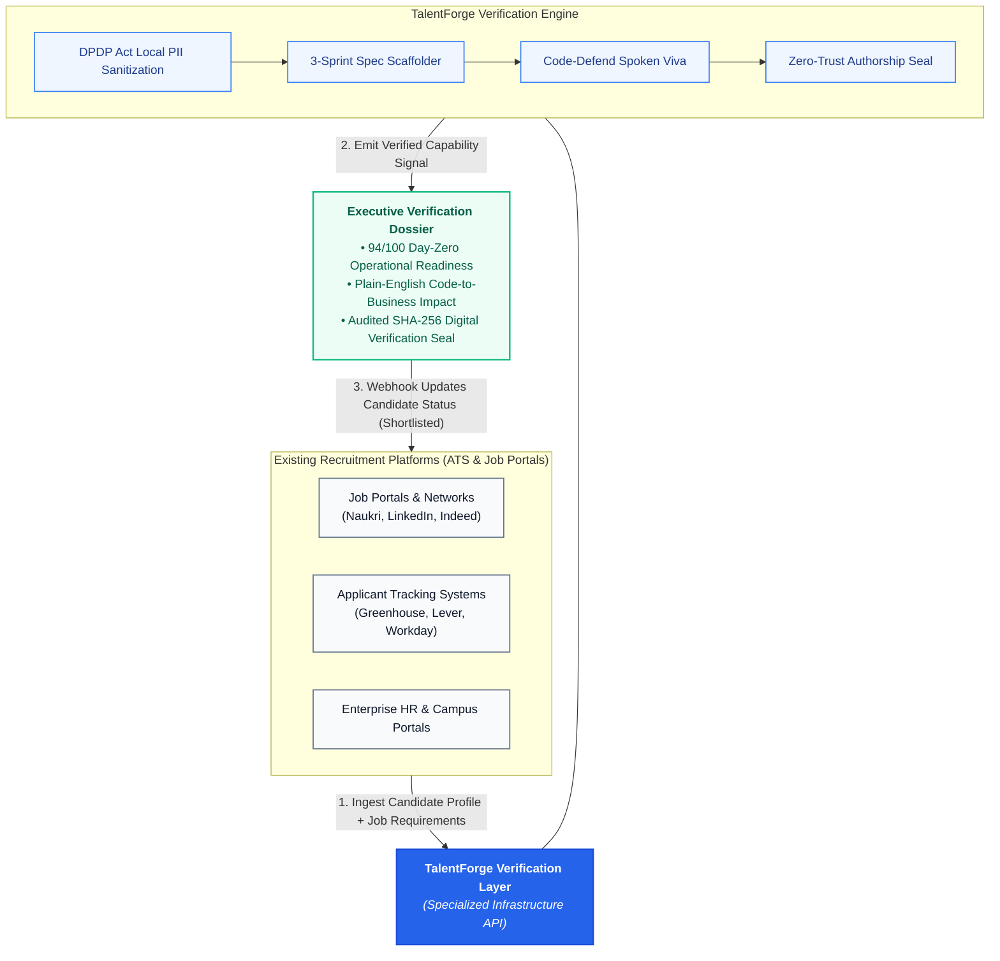
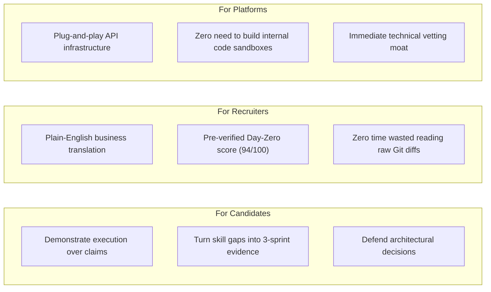
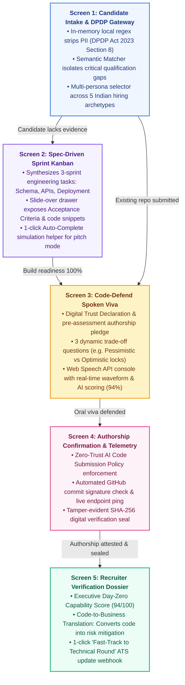

# TalentForge: Technical Verification Infrastructure for Existing Hiring Platforms

[](https://talentforge.alqatech.in)
[](https://react.dev/)
[](https://vite.dev/)
[](https://tailwindcss.com/)
[](https://ui.shadcn.com/)
[](https://www.typescriptlang.org/)
[](https://www.meity.gov.in/)
[](#hackathon-submission-dossier)

> **"We don't replace hiring platforms. We make them better at verifying technical talent."**  
> TalentForge is a technical verification and talent-readiness intelligence layer that existing hiring platforms (job portals, ATS platforms, and enterprise HR systems) can integrate into their workflows.

* **Live Hosted Prototype:** [https://talentforge.alqatech.in](https://talentforge.alqatech.in)  
* **Presenter:** Izzadhin Al Qassam A S (SMIT · Department of MBA in AI & Data Science)  
* **Track:** The Future of Work (Founder's Code 2026)

---

## 1. Product Positioning & Strategic Vision





---

## 2. Macro Problem Statement: The Three Gaps

1. **The Skills Gap**: A degree or resume doesn't prove job-ready execution. While 1.5 million technical graduates enter the Indian workforce annually, national employability stands at 56.35%, leaving an 82% skills deficit for Day-Zero operational roles.
2. **The Evidence Gap**: A GitHub repository no longer proves the candidate understands the code. Generative AI assistants allow anyone to scaffold and push production-looking code without comprehending fundamental architectural trade-offs.
3. **The Evaluation Gap**: Recruiters lack the technical bandwidth to evaluate every code repository, while automated ATS filters passively reject applicants on keyword matches without constructive feedback.

---

## 3. The 5-Screen Verification Workflow



---

## 4. System Architecture & Prototype Transparency

### Prototype Stack vs. Production Architecture

| System Layer | Current Working Prototype | Enterprise Production Roadmap |
| :--- | :--- | :--- |
| **Platform Integration** | Interactive demo persona selector & simulated intake | Bidirectional REST API & Webhook connectors for ATS |
| **Frontend UI** | React 19, Vite 8, Tailwind CSS v4, Shadcn UI (`bIm4yQd`) | Next.js 15 App Router with Edge SSR & embeddable widgets |
| **Backend / AI** | Isolated deterministic store (`src/data/demoData.ts`) | Python FastAPI asynchronous gateway + Sovereign 7B SLM |
| **Data Privacy** | In-browser regex token sanitizer (names, phones, emails) | Local Python regex tokenizer (DPDP Act 2023 Section 8) |
| **Database & Auth** | In-memory deterministic state | Supabase / PostgreSQL with RLS and immutable audit logs |
| **Viva Voice Engine** | Web Speech API & animated SVG/CSS waveform | Browser speech recognition & WebSocket audio streaming |
| **Verification Delivery** | Recruiter verification dossier screen | Signed, encrypted JSON payload pushed back to source ATS |

---

## 5. Local Quickstart & Setup Guide

### Prerequisites
* Node.js **v20+** or **v22+**
* npm **v9+** or **v10+**

### Installation & Run

```bash
# 1. Clone the repository and navigate to the frontend directory
git clone https://github.com/your-username/talent-forge.git
cd talent-forge/frontend

# 2. Install dependencies
npm install

# 3. Start local development server
npm run dev
```

Open your browser and navigate to **`http://localhost:5173`** or test the live hosted deployment at **`https://talentforge.alqatech.in`**.

---

## 6. Project Directory Layout

```
talent-forge/
├── JURY_DEMO_SCRIPT.md           # 3-Minute Chronological Pitch Script & Q&A Defense
├── knowledge-base.md             # Comprehensive Event Profile & Architecture Specs
├── pitch_deck_content.md         # Canonical 10-Slide Deck Matching TalentForge.pptx
├── README.md                     # Project Overview & System Dossier
├── TalentForge Slides/
│   └── TalentForge.pptx          # Official 10-Slide Presentation Deck
└── frontend/                     # Complete React 19 + Shadcn UI Web Application
    ├── src/
    │   ├── components/
    │   │   ├── screens/
    │   │   │   ├── LandingScreen.tsx        # Storytelling Overview & Ecosystem Flow
    │   │   │   ├── IntakeScreen.tsx         # Screen 1: Intake & DPDP Compliance Gateway
    │   │   │   ├── KanbanScreen.tsx         # Screen 2: Spec-Driven Sprint Scaffolder
    │   │   │   ├── VivaScreen.tsx           # Screen 3: Code-Defend Oral Defense Engine
    │   │   │   ├── ConfirmationScreen.tsx   # Screen 4: Authorship Confirmation & Repo Checks
    │   │   │   └── RecruiterCardScreen.tsx  # Screen 5: Recruiter Verification Dossier
    │   │   └── ui/                          # Shadcn UI Primitives (Card, Button, Sheet, etc.)
    │   ├── data/
    │   │   └── demoData.ts                  # Isolated Store: 5 Personas, Sprints & Rubrics
    │   ├── App.tsx                          # Header, 5-Screen Router & Architecture HUD
    │   └── index.css                        # Shadcn Theme Variables (Preset bIm4yQd)
    └── package.json
```

---

## License
Distributed under the MIT License. See `LICENSE` for more information.
